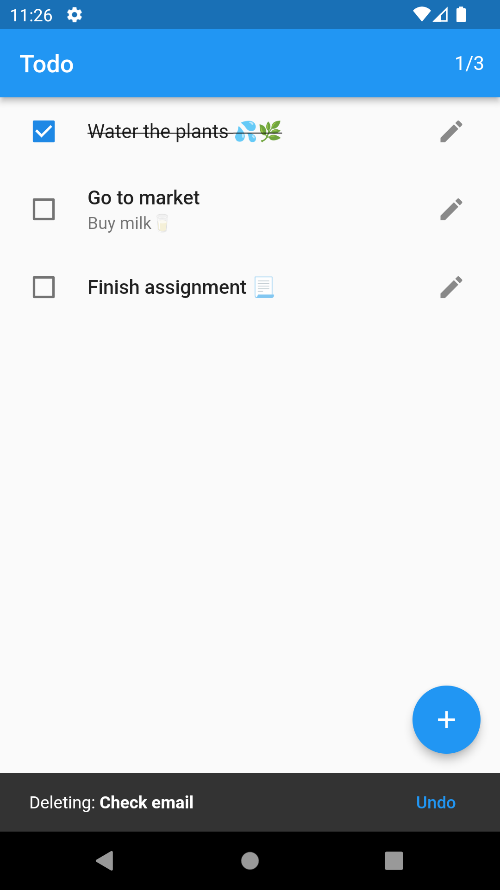
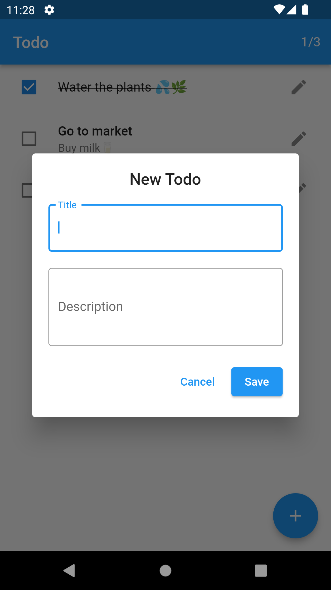
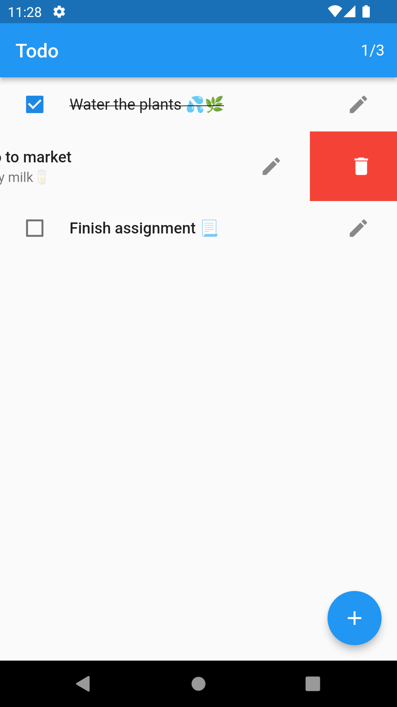
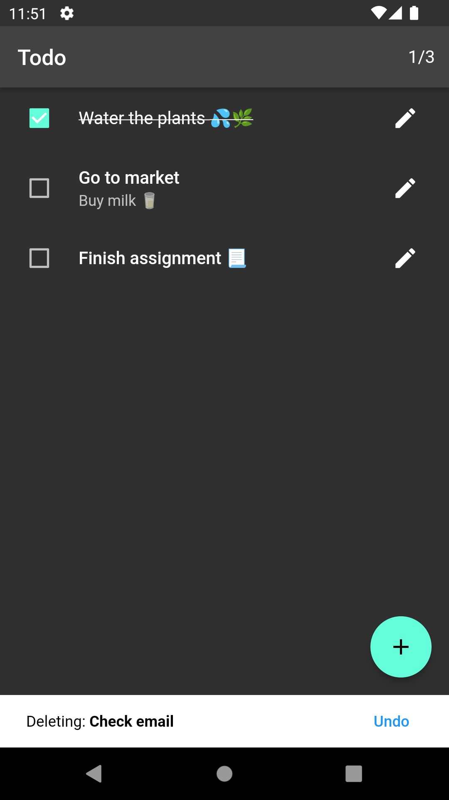

# Todo

A simple todo app in flutter (work in progress).

## Features

- Create todo with description
- Mark completed todo
- Update todo
- Delete todo
- Dark theme support
- Responsive UI

## Supported Platforms

- Android
- Linux
- Web

## Packages & APIs

- [flutter_bloc](https://pub.dev/packages/flutter_bloc)
- [localstorage](https://pub.dev/packages/localstorage)
- [window_size](https://github.com/google/flutter-desktop-embedding/tree/main/plugins/window_size)

## Screenshots

- ### Android

  

      
      
      
      
      
  

